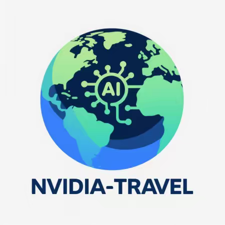
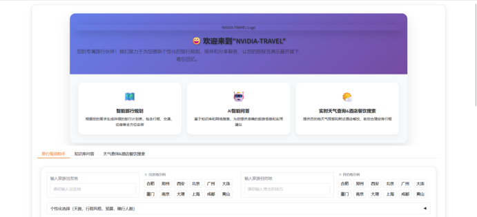
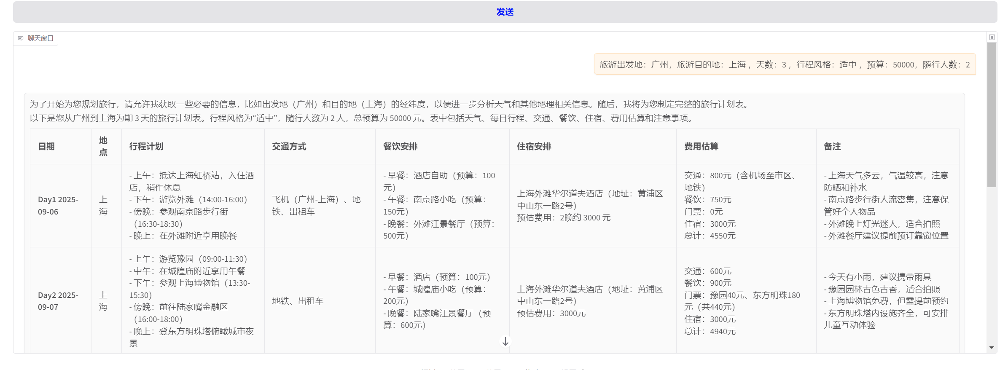
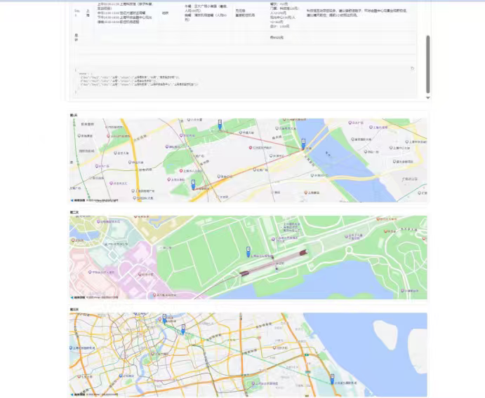

# NVIDIA-TRAVEL (AI旅游助手)

<div align="center">
   <!-- Placeholder for logo -->
  <p><em>让每一次出行更聪明、更轻松、更精彩</em></p>
</div>

## 📋 项目简介

亲爱的旅行者，欢迎体验 **NVIDIA-TRAVEL** —— 基于AI驱动的智能旅行助手。

融合 **NVIDIA NeMo Agent Toolkit** 与 **阿里云通义千问 (Qwen)** 大模型，我们打造了具备深度理解与推理能力的AI旅伴。无论您计划几日行程、偏好文化探索还是休闲度假，只需输入目的地、预算与兴趣，NVIDIA-TRAVEL 即可为您生成个性化旅行计划，涵盖每日行程、交通、住宿、餐饮与实用贴士，细致入微。

依托 **NeMo 工具链** 与 **RAG 技术**，系统精准检索全国热门景点与本地玩法，确保信息权威、实时、可靠。旅途中，您还可上传照片，AI将自动识别场景，并生成适配朋友圈、小红书、抖音、微博等平台风格的分享文案，轻松记录每一刻美好。

NVIDIA-TRAVEL，以英伟达强大AI算力为底座，让智能真正融入旅途。

🚀 **即刻启程，让AI陪您走遍山海，智享世界。**

## ✨ 核心特性

*   **先进AI架构**: 使用NVIDIA官方 [NeMo Agent Toolkit](https://github.com/NVIDIA/NeMo) 架构构建智能体核心。
*   **强大语言模型**: 集成阿里云 [通义千问 (Qwen)](https://help.aliyun.com/zh/qwen/) 大模型，提供卓越的自然语言理解和生成能力。
*   **智能旅行规划**: 行程规划与文案生成高效快捷，信息准确实用性高。
*   **多功能旅游问答**: 内置Agent实现查询天气、附近搜索、联网搜索等功能。
*   **智能场景分享**: 上传照片，自动生成适配社交平台的分享文案。

## 🏗️ 技术架构

### 后端

*   **核心框架**: 使用 [FastAPI](https://fastapi.tiangolo.com/) 作为后端Web框架，提供高性能RESTful API和WebSocket支持。
*   **AI Agent核心**: 基于NVIDIA NeMo Agent Toolkit构建智能体（Agent），负责用户意图理解、行程规划决策、工具调用（地图，天气，搜索）、多步推理与任务编排。
*   **大语言模型 (LLM)**: 阿里云 Qwen 大模型。
*   **RAG系统**: 使用 `langchain-community`、`langchain-core`、`milvus-lite` 构建知识检索增强生成系统。
*   **地图服务**: (根据文档提及) 使用高德地图MCP Server进行路线规划和地图显示。

### 前端

*   **交互界面**: 使用 [Gradio](https://www.gradio.app/) (`gradio==5.44.1`) 快速搭建 Web 交互界面。
*   **功能支持**: 支持上传照片、输入旅行需求、查看行程计划、预览分享文案等。
*   **设计定位**: 适合原型开发、演示或轻量级应用部署。
*   **可扩展性**: 可替换为 Vue/React + FastAPI 的前后端分离架构，但当前更偏向快速验证与内部使用。

## 🚀 快速开始

### 环境要求

*   **Python**: 3.12.0
*   **操作系统**: Windows, Linux

### 本地部署 (Windows/Linux)

1.  **克隆项目**:
    ```bash
    git clone https://gitee.com/gui-yusong/nvidia-travel.git
    cd nvidia-travel
    ```

2.  **手动安装依赖**:
    ```bash
    # 使用venv创建虚拟环境
    python -m venv venv
    source venv/bin/activate (Linux/macOS) 或 .\venv\Scripts\activate (Windows)

    pip install -r requirements.txt
    ```
    ```bash
    # 或者使用uv安装
    uv venv --python 3.12.0
    source .venv/bin/activate (Linux/macOS) 或 .venv\Scripts\activate (Windows)
    uv pip install -r requirements.txt
    ```

3.  **配置环境变量**:
    ```bash 
    #在.env中操作
    Weather_APP_KEY=您的和风天气API密钥
    amap_key=您的高德地图API密钥
    dashscope_api_key=您的阿里云百炼平台API密钥
    TAVILY_API_KEY=您的tavily API密钥
    #(请将”您的xxxAPI密钥“替换为实际从阿里云获取的API Key)
    ```

4.  **启动服务**:
    ```bash
    python3 app.py
    ```
    ```bash
    #或者用docker一键部署（不需要前面创建虚拟环境并pip）
    docker-compose up -d
    ```
5.  **访问地址**:
    在浏览器中打开 `http://127.0.0.1:7860` (默认Gradio端口) 或根据代码配置的端口访问。

## 📸 案例展示

1.  **项目首页**
<div align="center">
   
</div>

2.  **旅行助手旅游规划**
<div align="center">
   
</div>

3.  **旅游助手旅游路线规划**
<div align="center">
   
</div>

4.  **旅行助手旅游规划**
<div align="center">
   
</div>

## 🙏 致谢

感谢以下平台和技术提供支持：

*   **NVIDIA** 及其举办的黑客松比赛。
*   **NVIDIA** 提供的 [NeMo Agent Toolkit (AI-Q)](https://github.com/NVIDIA/NeMo)。
*   **阿里云** 提供的 [通义千问 (Qwen)](https://help.aliyun.com/zh/qwen/) 大模型。
*   **NVIDIA社区团队** 提供的技术支持。

## 📄 许可证

遵循木兰宽松许可证（第二版）
